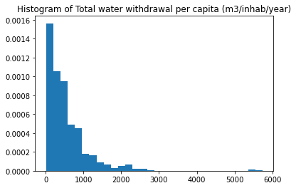
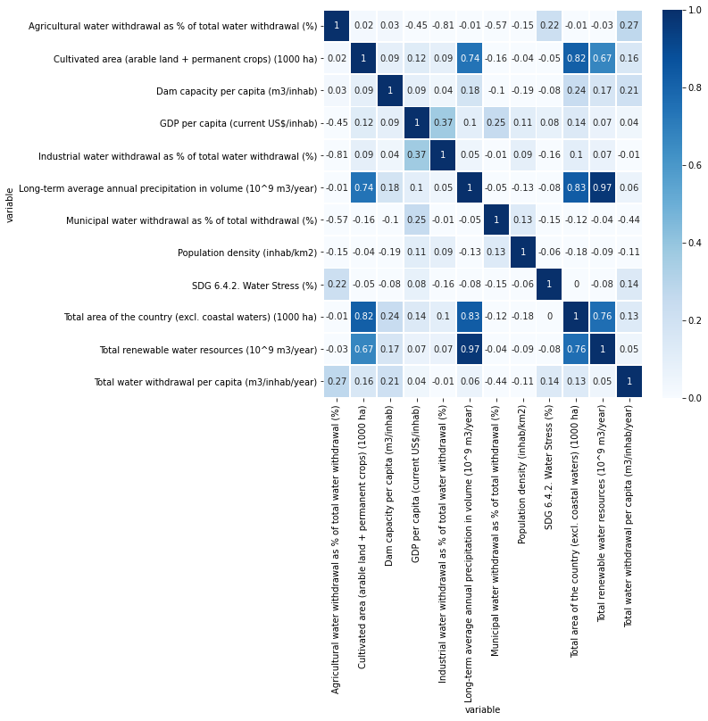

---
author-meta:
- Kathryn Grace Gunderson
- Yanan Chen
bibliography:
- content/manual-references.json
date-meta: '2020-12-06'
header-includes: '<!--

  Manubot generated metadata rendered from header-includes-template.html.

  Suggest improvements at https://github.com/manubot/manubot/blob/master/manubot/process/header-includes-template.html

  -->

  <meta name="dc.format" content="text/html" />

  <meta name="dc.title" content="CEE 498 Project 10: Water Withdrawal Prediction" />

  <meta name="citation_title" content="CEE 498 Project 10: Water Withdrawal Prediction" />

  <meta property="og:title" content="CEE 498 Project 10: Water Withdrawal Prediction" />

  <meta property="twitter:title" content="CEE 498 Project 10: Water Withdrawal Prediction" />

  <meta name="dc.date" content="2020-12-06" />

  <meta name="citation_publication_date" content="2020-12-06" />

  <meta name="dc.language" content="en-US" />

  <meta name="citation_language" content="en-US" />

  <meta name="dc.relation.ispartof" content="Manubot" />

  <meta name="dc.publisher" content="Manubot" />

  <meta name="citation_journal_title" content="Manubot" />

  <meta name="citation_technical_report_institution" content="Manubot" />

  <meta name="citation_author" content="Kathryn Grace Gunderson" />

  <meta name="citation_author_institution" content="Civil and Environmental Engineering, University of Illinois at Urbana-Champaign" />

  <meta name="citation_author" content="Yanan Chen" />

  <meta name="citation_author_institution" content="Civil and Environmental Engineering, University of Illinois at Urbana-Champaign" />

  <link rel="canonical" href="https://gooood-night.github.io/Project10_Water_Withdrawal_Prediction/" />

  <meta property="og:url" content="https://gooood-night.github.io/Project10_Water_Withdrawal_Prediction/" />

  <meta property="twitter:url" content="https://gooood-night.github.io/Project10_Water_Withdrawal_Prediction/" />

  <meta name="citation_fulltext_html_url" content="https://gooood-night.github.io/Project10_Water_Withdrawal_Prediction/" />

  <meta name="citation_pdf_url" content="https://gooood-night.github.io/Project10_Water_Withdrawal_Prediction/manuscript.pdf" />

  <link rel="alternate" type="application/pdf" href="https://gooood-night.github.io/Project10_Water_Withdrawal_Prediction/manuscript.pdf" />

  <link rel="alternate" type="text/html" href="https://gooood-night.github.io/Project10_Water_Withdrawal_Prediction/v/2086c435af56210ad41040bbda505d9c1220aed7/" />

  <meta name="manubot_html_url_versioned" content="https://gooood-night.github.io/Project10_Water_Withdrawal_Prediction/v/2086c435af56210ad41040bbda505d9c1220aed7/" />

  <meta name="manubot_pdf_url_versioned" content="https://gooood-night.github.io/Project10_Water_Withdrawal_Prediction/v/2086c435af56210ad41040bbda505d9c1220aed7/manuscript.pdf" />

  <meta property="og:type" content="article" />

  <meta property="twitter:card" content="summary_large_image" />

  <link rel="icon" type="image/png" sizes="192x192" href="https://manubot.org/favicon-192x192.png" />

  <link rel="mask-icon" href="https://manubot.org/safari-pinned-tab.svg" color="#ad1457" />

  <meta name="theme-color" content="#ad1457" />

  <!-- end Manubot generated metadata -->'
keywords:
- water withdrawal per capita
- neural network
- random forest
lang: en-US
manubot-clear-requests-cache: false
manubot-output-bibliography: output/references.json
manubot-output-citekeys: output/citations.tsv
manubot-requests-cache-path: ci/cache/requests-cache
title: 'CEE 498 Project 10: Water Withdrawal Prediction'
...

<small><em>
This manuscript
([permalink](https://gooood-night.github.io/Project10_Water_Withdrawal_Prediction/v/2086c435af56210ad41040bbda505d9c1220aed7/))
was automatically generated
from [gooood-night/Project10_Water_Withdrawal_Prediction@2086c43](https://github.com/gooood-night/Project10_Water_Withdrawal_Prediction/tree/2086c435af56210ad41040bbda505d9c1220aed7)
on December 6, 2020.
</em></small>

## Authors

+ **Kathryn Grace Gunderson** 
    · {.inline_icon}
    [kggunde2](https://github.com/kggunde2) 
  <small>
     Civil and Environmental Engineering, University of Illinois at Urbana-Champaign
  </small>

+ **Yanan Chen** 
    · {.inline_icon}
    [gooood-night](https://github.com/gooood-night) 
  <small>
     Civil and Environmental Engineering, University of Illinois at Urbana-Champaign
  </small>

## 1. Introduction
### 1.1 Background
Water is a crucial and finite resource. Only one percent of the water in the world is readily accessible for human use. With the increase of population and the development of society and economics, many countries are faced with water scarcity. In recent years, climate change and land use changes have affected hydrological processes, bringing high uncertainty to precipitation and river flow. Consequently, the water supply systems are under huge pressure. In this case, improving the accuracy of water consumption prediction is of vital importance, which is not only necessary to design new water facilities, but also essential to optimize the operation and management of the existing water supply systems. 

Water consumption is affected by many factors, such as water availability, climate, demographics, economics, etc. Machine learning (ML) methods have the ability to capture the correlations between independent variables and the non-linear relationships between features and target variables, so ML methods have been widely applied to complex water consumption modeling and water demand prediction. Villarin and Rodriguez-Galiano (2019) applied two tree-based machine learning methods, including classification and regression trees (CART) and random forest (RF), to the water demand modeling in the city of Seville, Spain at the census tract level. They chose 16 variables that represent the sociodemographic and urban building characteristics of urban area as the independent variables to predict water consumption per capita. The results show that the RF model performs better than the CART model. 

In another study done by Sahour et al. (2020), scientists used machine learning methods to predict groundwater salinity, which is an affect of excessive groundwater withdrawal. Their study is relevant because it gives a layout of how to setup different machine learning algorthims for hydrological data with many indpendent variables. They tested three methods extreme gradient boosting, deep neural network, and multiple linear regression. They had a small dataset of 162 observations therefore extreme gradient boosting gave the more accurate model. The scope of their study was concentrated in one 10,000 km squared location, while we plan to look at global data for our project, therefore their study may not transfer well to our data.

### 1.2 Objective
The goal of the project was to use machine learning algorithms to predict water withdrawal per capita in the world. Compared with previous studies, our project used worldwide data at national scale rather than data from one city or one country, and we involved more independent variables such as water stress, renewable water resources, and GDP per capita in order to improve the prediction results. Meanwhile, we planned to test two machine learning algorithms: Neural Networks and Random Forest to predict the target variable and compare the model performances. The goal was to find a ML method that produced accurate predictions of water withdrawal, which would allow for improvement of water resources planning and management.

## 2. Data
### 2.1 Raw Data
The raw dataset was obtained from FAO's Global Information System on Water and Agriculture (AQUASTAT). AQUASTAT provides free access to over 180 variables and indicators by country dating back to the 1960s. The variables are mainly related to water resources, water uses and agricultural water management. 
In this project, we intend to predict annual total water withdrawal per capita and select 13 variables as features based on previous studies, which provide information about geography, economy, climate, water resource utilities, etc. After variable selection, the raw dataset used includes 1 dependent variable and 13 features that span 200 countries across 8 different five-year periods from 1978 to 2017. 

### 2.2 Exploratory Data Analysis
Our project aims at predicting water withdrawal per capita. Water withdrawal per capita is affected by many factors, such as water availability, climate, demographics, economics, etc. Let's first look at the water withdrawal per capita.

{#fig: histogram width="4in"}

As shown in Figure 1, the distribution of total water withdrawal is not symmetric. For 75% of the entries, the annual total water withdrawal per capita is less than 704.7 m3/inhab/year, while the maximum annual total water withdrawal per capita is 5739 m3/inhab/year. The difference between countries is huge. Let us closely look at the average annual total water withdrawal per capita during 2013-2017 in each country.

{#fig: world width="7in"}

Although the water withdrawal data during 2013-2017 of many African and west Asian countries is missing, we can find that the water withdrawal per capita varies among countries from Figure 2. For most countries, the total water withdrawal per capita is below 500 m3/inhab/year, but for Canada, the United States, Kazakhstan and Uzbekistan, the value is above 1000 m3/inhab/year.

We can visualize the missing data in the features by using an msno matrix. 

{#fig: missing_data width="8in"}

As we can see above from the msno matrix, the features with the least amount of missing data are cultivated area, GDP per capita, long-term average annual precipitation, population density, total area of the country, and total renewable water resources. This information helps us select which features to include in the model. 

The raw dataset includes 13 numerical independent variables. It is found that "Human Development Index (HDI)" and "Total population with access to safe drinking-water" are two variables with the most missing values. Meanwhile, the correlation coefficients between the target variables and these two independent variables are small. So, these two variables were dropped. After further data cleaning, we had a dataset with 410 samples and 11 numerical features and 2 categorical features for predicting water withdrawal per capita.

The figure below shows how the 11 independent variables correlate with the target variable and each other. As can be seen, "Long-term average annual precipitation in volume (10^9 m3/year)" and "Total renewable water resources (10^9 m3/year)" are highly related with the correlation coefficient of 0.97. We need to remove one of them for ML model input in data preprocessing.

{#fig: corr_matrix width="6.5in"}

As mentioned previously most of the values for total water withdrawal per capita around below 500 m^3/inhab/yr. To further explore if any features correlate with high and low values of total water withdrawal the average value for each feature was found for each country over the different time periods. Then the data was broken up into countries that have values below 400 m^3/inhab/yr and above that value. Then we looked at the distribution of the features above and below to see if any conclusions could be made about how the features relate to the total water withdrawal. Below are histograms of the features that correspond to countries with an average water withdrawal per capita less than 400. 

{fig: corr_matrix width="6in"}
{fig: corr_matrix width="5in"}
{fig: corr_matrix width="6in"}
{fig: 400_ corr_matrix width="6in"}

Below are histograms of the features that correspond to countries with an average water withdrawal per capita greater than 400. 

{#fig: corr_matrix width="6in"}
{fig: corr_matrix width="6in"}
{fig: corr_matrix width="6in"}
{fig: more corr_matrix width="6in"}

Comparing the set of histograms for the countries that have an average water withdrawal lower than 400 m^3/inhab/year and those that have higher than 400 there are some differences that could help predict the average water withdrawal. The agricultural water withdrawal, population density, cultivated area, and GDP tends to be higher for countries with a higher average water withdrawal than 500. Total area of the country, municipal water withdrawal tends to be higher for countries with a lower average water withdrawal than 500.

## 3. Methods
### 3.1 Neural Network
Predicting water withdrawal per capita is a complex problem considering various affecting factors and non-linear relationships. In this project, one of the models we chose was neural network. Artificial Neural Networks have the ability to learn and model non-linear relationships, which is really important for water withdrawal prediction problem.

- Step 1: Data Preprocessing

As there is no missing value in training and testing datasets, we only performed feature scaling for numerical variables based on the training dataset. In this step, we normalized the numerical input variables with skew higher than 3 and then standardized all the numerical variables. Considering the distribution of the target variable was skewed, we also normalized the target variable using log transformation.
Since there are two categorical variables (i.e. country and year), we also did some feature engineering using one hot encoding to prepare the categorical variables for use in the model.

- Step 2: Modeling

We designed a DNN model with one feature layer, three hidden layers, one linear single-output layer and one layer that inversed the standardization transformation. And for each hidden layer, there was 64 units. To reduce overfitting, dropout was implemented per-layer in the neural network. We chose rectified linear unit activation function (ReLU) as the activation function of hidden layers, which is not only easier to compute but also works better than a smooth function such as the sigmoid. Besides, we chose Mean Squared Error (MSE) as the loss function of our model.

- Step 3: Hyperparameter Tuning

We used Grid Search to tune hyperparameter, which can test the performance of different combinations of hyperparameter values and find the optimal one. The hyperparameters that were tuned included learning rate, batch size, epochs and dropout rate. In this step, we ignored two categorical variables and only used ten numerical variables as the chosen features. 

- Step 4: Predicting 

After obtaining the best combination of hyperparameter values, we trained the neural network using training set (287 examples * 80%) and checked the performance of model using validation set (287 examples * 20%). Then we used it to predict the annual water withdrawal per capita in the testing set (123 examples).

### 3.2 Random Forest Regression
The other model tested to predict our target variable is a Random Forest Regression (RFR). RFR was selected because we need a non linear model. In this case we want a regression model rather than a classification model because we have numerical values rather than categorical values to predict. One of the shortcomings that could inhibit the accuracy of the model is that a Random Forest Regression cannot predict values that are higher than the values in the training data.

- Step 1: Data Preprocessing

There are not missing values from our training and testing models. First we looked at a description of the data to make sure there were no constant values that needed to be removed. After that we checked the data types and changed all object variables to integers using one hot encoding. After this we looked at the distribution of the target variable to check for skewness. The target variable had right skewness, therefore we normalized the target variable using a log transformation to improve the model predictions. We split the training data into training data and validation data to prevent overfitting the model to the training data. 

- Step 2: Modeling

The first random forest regression model we made based on adjusting the n-estimaters parameter until we got the highest percent accuracy on the validation data. The accuracy was calculated using the mean absolute error of the predictions compared to the actual values of the validation data. A random state of 42 was added to the model to create consistency. 

- Step 3: Hyperparameter Tuning

To improve the accuracy of the model we used both randomized search cross validation and grid search cross validation. The hyperparemeters tested were n_estimators, min_samples_split, min_samples_leaf, max_features, max_depth, and bootstrap. The randomized search CV was used to narrow down the range of the parameters. Then grid search CV compares all combinations of inputs. We performed the grid search CV and stopped when the accuracy stopped improving. Next we checked the feature importances and checked the accuracy of the model using the four most important features. The accuracy did not change when only the four most important features were used therefore we changed the model to only use those four features in predicting the target variable. 

- Step 4: Predicting

We used the best combination of hyperparemeters from the grid search CV and the four most important features to predict the target variable. 

## 4. Results
### 4.1 Results of Neural Network
We used tensorflow to build Neural Network in this project. The default values of hyperparameters are as follows: learning rate = 0.01, batch size = 40, epoch = 50, and dropout rate = 0.1. The performance of this model is shown in figures. The RMSE of the training data was 174.35 and the RMSE of the testing data was 259.79.

{#fig: before width="4in"}

{#fig: before_training width="4in"}

{#fig: before_validation width="4in"}

We used Grid Search to tune the hyperparameters to improve the model performance. The results are shown in Table 1.

| Hyperparameters | Possible values     | Best value       |
|:-----------------|:-------------:|:-------------:|
| Batch Size | 2, 4, 8, 16,32, 64 | 64 | 
| Epochs | 10, 50, 100, 200  |100 |
| Learning rate | 0.001, 0.005, 0.01, 0.05, 0.1, 0.2| 0.005 |

Table: **The results of hyperparameter tuning**
{#tbl:tuning}

In addition, we tested several dropout rates to find the value that can reduce overfitting. The results are shown in Table 2 and figures below.

| Dropout rate |  RMSE of Traning data     | RMSE of Validation data  |
|:-----------------|:-------------:|:-------------:|
| 0.1 | 77.03 | 167.24 | 
| 0.2 | 87.31 | 219.42 |
| 0.3 | 312.99| 242.12 |

Table: **Model performance under different dropout rate**
{#tbl:dropout}

{#fig: dropout_0.1 width="4in"}

{#fig: dropout_0.2 width="4in"}

{#fig: dropout_0.3 width="4in"}

As dropout rate increased, the overfitting problem can be reduced, but the RMSE of both the training data and the validation did not decrease. Therefore, we still set the dropout rate at 0.01, which gave the best performance of the model.
So, we find the best combination of hyperparameter values as follows:

- batch size = 64
- epoch = 100
- learning rate = 0.005
- dropout rate = 0.1

{#fig: after_training width="4in"}

{#fig: after_validation width="4in"}

Finally, we used this neural network to predict the total annual water withdrawal per capita in the testing dataset, and the Root Mean Squared Error was 144.82.

### 4.2 Results of Random Forest Regression

The model was built using random forest regressor with the initial hyperparameters set to n-estimators = 100 and random state = 42. The mean absolute error was 0.41 degrees and the percent accuracy was 92.98%. 

Next we used randomized search CV and did two grid search CV to tune the hyperparemeters and find the best combination. Below are the mean absolute error and percent accuracy for each of the attempts. 

| Tuning Attempt |  MAE of Validation data     | % Accuracy of Validation data  |
|:-----------------|:-------------:|:-------------:|
| Randomized Search CV | 0.4 | 93.2% | 
| Grid Search CV 1 | 0.4 | 93.2% |
| Grid Search CV 2 | 0.4 | 93.2% |

Table: **Model performance**
{#tbl:mae}

As can be seen in the table, the accuracy of the model did not improve much after the first cross validation. The final hyperparamters selected for the model were:

- n estimators: 1000
- min samples split: 2
- min samples leaf: 1
- max features: 3
- max depth: 60
- bootstrap: true
- random state: 42

After selecting the hyperparameters I next looked at the figure importance and made a plot of the top 12 features to better visualize the weight of each feature on the model. 

{#fig: __ }

The top four most important features were % Municipal Water Withdrawal, GDP per Capita, Water Stress, and Dam Capacity per Capita. We wanted to test how the accuracy of the model changed if we only used the top four most important features. We made a new dataframe that only included those four features and used the same hyperparamters as above and tested for the mean absolute error and percent accuracy in the validation data. The mae was 0.41 degrees and the percent accuracy was 93.09%. Since the accuracy changed by 0.11%, We decided to go with the simpler model and only include those four features. 

After applying the model to the testing dataframe the final root mean squared error was 264.13 m^3/inhab/yr. 

## 5. Conclusion

Comparing the root mean squared error of the two methods used, the Neural Network algorithm had the lower value of root mean squared error. Therefore this model was more accurate at predicting the target variable: annual total water withdrawal per capita. This model had a root mean squared error of 122.08 m^3/inhab/yr, which in the context of the problem is acceptable due to the spread of the data for the target variable. The model could give countries an idea of where to expect their total water withdrawal to be when changing different parameters that were included in the model. To expand on this model, different features could be tested and having more data could improve the accuracy of the model. 

## 6. References

AQUASTAT Database &nbsp;, Food and Agriculture Organization of the United Nations, www.fao.org/nr/water/aquastat/data/query/index.html?lang=en. 

Sahour, Hossein, et al. “A Comparative Analysis of Statistical and Machine Learning Techniques for Mapping the Spatial Distribution of Groundwater Salinity in a Coastal Aquifer.”         Journal of Hydrology, Elsevier, 19 July 2020, www.sciencedirect.com/science/article/pii/S0022169420307812. 

Villarin, M. C., & Rodriguez-Galiano, V. F. (2019). Machine learning for modeling water demand. Journal of Water Resources Planning and Management, 145(5), 04019017.

## References {.page_break_before}

<!-- Explicitly insert bibliography here -->

